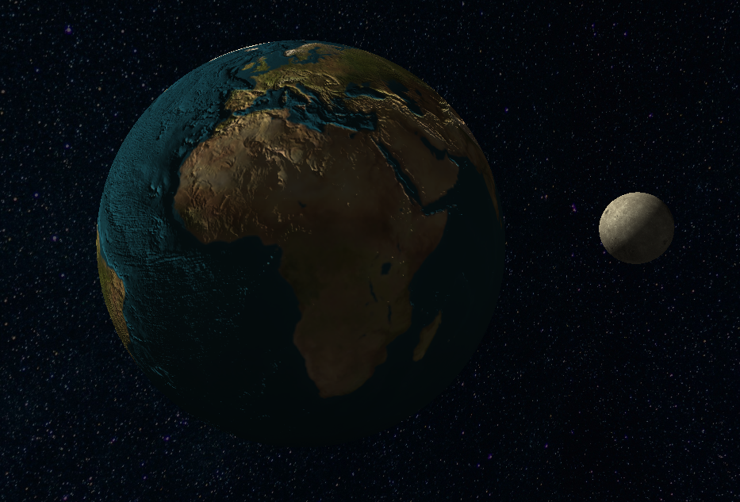

# Computer Graphics Orbit Project
- **Computergraphik WS24/25**
- **Marius Wenk**

## Description
This is a computer graphics OpenGL project. Inside you can find a model of the earth and the moon. The executable offers an interactive visualization of the scene.

## Content:
1. [Techniques](#techniques-used)
2. [Requirements](#requirements-inside-this-project)
3. [Also helpful](#also-helpful)
4. [Preview](#preview)
5. [Installation (Windows)](#installation-windows)
6. [Sources](#sources)

## Techniques used:
- Representation of a sphere through ikosaeder subdivision
- Phong Lighting Model
- Texture Mapping of a sphere
- Rotational and translational transformation
- Skybox using a cubemap
- Camera modification (direction and movement)
- Normal Mapping to visualize details

## Requirements inside this project:
- Glad
- GLFW
- GLM
- KHR
- STB (Loading and Creation of Textures)

## Also helpful:
- Git
- cmake
- Visual Studio 2022

## Preview:

- [Progress Video](https://cmsa3-my.sharepoint.com/:v:/g/personal/marius_wenk_cmsa3_onmicrosoft_com/EfI6vkQBwpVLoHtqJMDMB10Bz5awCO3PFBs8MpqTJIxI4A) - access with HU-CMS-Office account

### Installation (Windows):
1. Clone Repository:
```sh
git clone https://github.com/rekordii/OpenGL_Orbit.git
```
2. Switch to executable directory:
```sh
cd .\OpenGL_Orbit\x64\Debug\
```
3. Start .exe:
```
.\final.exe
```

### Sources:
- [Earth Texture](https://th.bing.com/th/id/R.49e70c16f0865fea9f4b7459d87be132?rik=dQBCVIAoMfqS5g&pid=ImgRaw&r=0)
- [Moon Texture](https://www.3dart.it/en/download-moon-texture-nasa/)
- [Universe Texture](https://wallpapercave.com/sky-full-of-stars-wallpapers)
- [Earth Normal Map](https://th.bing.com/th/id/OIP.p1BAV4sK03Q-YLECjEsBkgHaDt?pid=ImgDet&w=207&h=103&c=7&dpr=1,1)

- Guided by [Learn OpenGL](https://learnopengl.com/)
- Supported by [Victor Gordan](https://www.youtube.com/watch?v=z03LXhRBLGI&list=PLPaoO-vpZnumdcb4tZc4x5Q-v7CkrQ6M-&index=2) and [his work](https://github.com/VictorGordan/opengl-tutorials)
- Inspired by [lab1&2](https://moodle.hu-berlin.de/mod/folder/view.php?id=4707372)
